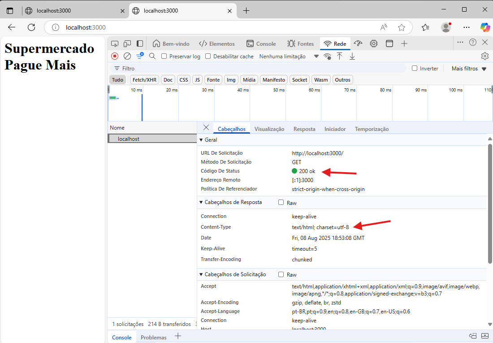

# Laboratório 001 - Aprendendo a trabalhar com rotas sem biblioteca adicional

# PARTE I - ANALISE DE REQUISITOS

### SEQUENCIA DA SPRINT: A001

## 1. Descrição da Situação Problema

Um pequeno mercado de bairro chamado mercadinho da Juju precisa de uma aplicação com back-end para mostrar as coisa que vende. Crie a aplicação de acordo com a análise de requisitos


## 2. Estórias de usuario

COMO cliente 

QUERO ver os produtos vendidos no mercadinho da Juju 

PARA saber se o mercado vende o produto que eu preciso antes de ir ao mercado

##  3. Critérios de Aceitação
- A aplicação deve ter uma rota raiz (/) que mostre o nome do mercado.

- Deve existir pelo menos 3 rotas de categorias (ex: /frutas, /verduras, /bebidas), cada uma retornando uma lista de produtos.

- O retorno deve estar no formato HTML.

- O servidor deve responder com status code 200 para rotas existentes e 404 para rotas inexistentes.

- O charset deve ser configurado como UTF-8 no header Content-Type.

##  4. Casos de teste

| ID   | Cenário                                | Ação                                    | Resultado Esperado |
|------|----------------------------------------|------------------------------------------|--------------------|
| CT01 | Acessar rota raiz `/`                  | Fazer requisição GET para `/`            | Retornar HTML com o texto **"Mercadinho da Juju"** e status **200** |
| CT02 | Acessar `/frutas`                      | Fazer requisição GET para `/frutas`      | Retornar HTML contendo pelo menos **3 frutas** e status **200** |
| CT03 | Acessar `/verduras`                    | Fazer requisição GET para `/verduras`    | Retornar HTML contendo pelo menos **2 verduras** e status **200** |
| CT04 | Acessar `/bebidas`                     | Fazer requisição GET para `/bebidas`     | Retornar HTML contendo pelo menos **2 bebidas** e status **200** |
| CT05 | Acessar rota inexistente `/xpto`       | Fazer requisição GET para `/xpto`        | Retornar status **404** e mensagem **"Página não encontrada"** |
| CT06 | Verificar charset                      | Fazer requisição para qualquer rota      | Header `Content-Type` deve conter **charset=utf-8** |


##  5. Casos de teste

Vamos criar uma aplicação que devolva algumas informações de acordo com a rota escolhida

Preste Atenção: 

- Os códigos devem ser criado dentro da pasta raiz desta aplicação. NÂO crie dentro de template
- Abra esta pasta no VSCode corretamente, veja se você não acabou abrindo sua pasta de projetos (geralmente com seu nome) em vez da pasta deste projeto

# PARTE II - DESENVOLVENDO O PROJETO

## 6. Inicie o projeto básico

Inicie o projeto (você já deve saber fazer isto)

```npm init -y```

./index.js

```javascript
const http = require('http');
const porta = 3000

const server = http.createServer((req, res) => {
    
    //Mostra a rota solicitada
    url = req.url
    console.log('url: ',url);

    //Aqui vão as Rotas
    res.end('inicio do projeto'); //sera excluido no prox. passo
});

server.listen(porta, () => {
    console.log('Servidor rodando');
    console.log('Endereco: http://localhost:' + porta);
});
```

## 2. Modifique o código para selecionar o retorno de acordo com a rota

Modifique o código para mostrar rodas de acordo com o que foi enviado.

./index.js

```javascript
    //Aqui vão as Rotas
    if(url === '/') {
        res.end('<h1>Mercadinho da Juju</ul>');
    } else {
       res.writeHead(404,'Pagina não encontrada',{ 'Content-Type': 'text/html; charset=utf-8' }) //rota nao cadastrada
       res.end('Pagina não encontrada');
    }
```

### Observações sobre o código:

 ``` writeHead(statusCode[, statusMessage][, headers])```

Uso: Define o código de retorno e headers

statusCode: número, obrigatório — o código HTTP da resposta (ex: 200, 404, 500)

statusMessage: string, opcional — uma mensagem de status customizada (ex: "OK", "Nao encontrado")

headers: objeto, opcional — pares chave-valor para os cabeçalhos HTTP (ex: { 'Content-Type': 'text/html' })

### Links de aprofundamento

JavaScript: if...else

<https://www.devmedia.com.br/javascript-if-else/41014>

Content-Type

<https://developer.mozilla.org/pt-BR/docs/Web/HTTP/Reference/Headers/Content-Type>

Códigos de status de respostas HTTP

<https://developer.mozilla.org/pt-BR/docs/Web/HTTP/Reference/Status>

## Faça os seguintes testes

1. abra as ferramentas de desenvolvedor
2. Selecione a guia rede
3. Recarregue a pagina se for preciso
4. Clique em cima da requisição
5. Observe como os campos foram preenchidos



## 3. Configurando a rota verduras

Vamos modificar o código para que ao chamar a Rota /verduras deve ser retornado uma lista de verduras.

Verifique o código abaixo e acrescente as partes faltantes

```javascript
    //Aqui vão as Rotas
    if(url === '/') {
        res.writeHead(200,'ok',{ 'Content-Type': 'text/html; charset=utf-8' }) 
        res.end('<h1>Supermercado Pague Mais</ul>');
    } 
    else if(url === '/verduras'){ //nova rota acrescentada
        res.writeHead(200,'ok',{ 'Content-Type': 'text/html; charset=utf-8' }) 
        res.end('<ul><li>alface</li><li>rucula</li></ul>');
    }
    else {
       res.writeHead(404,'Pagina não encontrada',{ 'Content-Type': 'text/html; charset=utf-8' }) //rota nao cadastrada
       res.end('Pagina não encontrada');
    }
```

## 4. Sua vez de trabalhar

Acrescente as seguintes rotas na aplicação : 

rota: /frutas

Retorno:

```html
<ul>
    <li>maçã</li>
    <li>banana</li>
    <li>laranja</li>
</ul>
```
rota: /carnes

Retorno

```html
<ul>
    <li>frango</li>
    <li>carne bovina</li>
    <li>peixe</li>
</ul>
```
rota: /bebidas

Retorno

```html
<ul>
    <li>água</li>
    <li>suco de laranja</li>
    <li>refrigerante</li>
</ul>
```